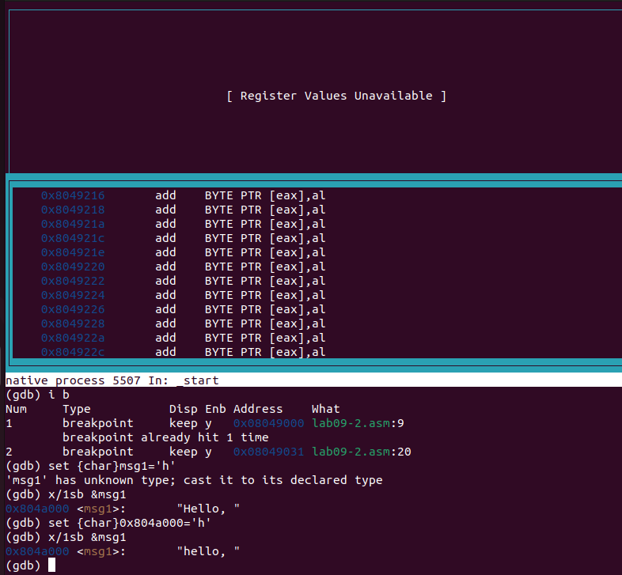

---
## Front matter
title: "Отчёт по лабораторной работе №9"
subtitle: "Дисциплина: архитектура компьютеров и операционные системы"
author: "Нуруллаев Бахадур"

## Generic otions
lang: ru-RU
toc-title: "Содержание"

## Bibliography
bibliography: bib/cite.bib
csl: pandoc/csl/gost-r-7-0-5-2008-numeric.csl

## Pdf output format
toc: true # Table of contents
toc-depth: 2
lof: true # List of figures
lot: true # List of tables
fontsize: 12pt
linestretch: 1.5
papersize: a4
documentclass: scrreprt
## I18n polyglossia
polyglossia-lang:
  name: russian
  options:
	- spelling=modern
	- babelshorthands=true
polyglossia-otherlangs:
  name: english
## I18n babel
babel-lang: russian
babel-otherlangs: english
## Fonts
mainfont: PT Serif
romanfont: PT Serif
sansfont: PT Sans
monofont: PT Mono
mainfontoptions: Ligatures=TeX
romanfontoptions: Ligatures=TeX
sansfontoptions: Ligatures=TeX,Scale=MatchLowercase
monofontoptions: Scale=MatchLowercase,Scale=0.9
## Biblatex
biblatex: true
biblio-style: "gost-numeric"
biblatexoptions:
  - parentracker=true
  - backend=biber
  - hyperref=auto
  - language=auto
  - autolang=other*
  - citestyle=gost-numeric
## Pandoc-crossref LaTeX customization
figureTitle: "Рис."
tableTitle: "Таблица"
listingTitle: "Листинг"
lofTitle: "Список иллюстраций"
lotTitle: "Список таблиц"
lolTitle: "Листинги"
## Misc options
indent: true
header-includes:
  - \usepackage{indentfirst}
  - \usepackage{float} # keep figures where there are in the text
  - \floatplacement{figure}{H} # keep figures where there are in the text
---

# Цель работы

Приобретение навыков написания программ с использованием подпрограмм. Знакомство
с методами отладки при помощи GDB и его основными возможностями.

# Задание

1. Реализация подпрограмм в NASM.

2. Отладка программам с помощью GDB.

3. Добавление точек останова.

4. Работа с данными программы в GDB.

5. Обработка аргументов командной строки в GDB.

6. Задания для самостоятельной работы.

# Теоретическое введение

Отладка — это процесс поиска и исправления ошибок в программе. Отладчики позволяют управлять ходом выполнения программы, контролировать и изменять данные. Это помогает быстрее найти место ошибки в программе и ускорить её
исправление. Наиболее популярные способы работы с отладчиком — это использование
точек останова и выполнение программы по шагам.

GDB (GNU Debugger — отладчик проекта GNU) работает на многих UNIX-подобных
системах и умеет производить отладку многих языков программирования. GDB предлагает
обширные средства для слежения и контроля за выполнением компьютерных программ. Отладчик не содержит собственного графического пользовательского интерфейса и использует стандартный текстовый интерфейс консоли. Однако для GDB существует несколько сторонних графических надстроек, а кроме того, некоторые интегрированные среды разработки используют его в качестве базовой подсистемы отладки.

Отладчик GDB (как и любой другой отладчик) позволяет увидеть, что происходит «внутри»
программы в момент её выполнения или что делает программа в момент сбоя.

Команда run (сокращённо r) — запускает отлаживаемую программу в оболочке GDB.

Команда kill (сокращённо k) прекращает отладку программы, после чего следует вопрос
о прекращении процесса отладки. Если в ответ введено y (то есть «да»), отладка программы прекращается. Командой run её можно начать заново, при этом все точки останова (breakpoints), точки просмотра (watchpoints) и точки отлова (catchpoints) сохраняются.

Для выхода из отладчика используется команда quit (или сокращённо q).

Если есть файл с исходным текстом программы, а в исполняемый файл включена информация о номерах строк исходного кода, то программу можно отлаживать, работая в отладчике
непосредственно с её исходным текстом. Чтобы программу можно было отлаживать на
уровне строк исходного кода, она должна быть откомпилирована с ключом -g.

Установить точку останова можно командой break (кратко b). Типичный аргумент этой
команды — место установки. Его можно задать как имя метки или как адрес. Чтобы не было путаницы с номерами, перед адресом ставится «звёздочка».

Информацию о всех установленных точках останова можно вывести командой info (кратко i).

Для того чтобы сделать неактивной какую-нибудь ненужную точку останова, можно воспользоваться командой disable.

Обратно точка останова активируется командой enable.

Если же точка останова в дальнейшем больше не нужна, она может быть удалена с помощью
команды delete.

Для продолжения остановленной программы используется команда continue (c). Выполнение программы будет происходить до следующей точки останова.
В качестве аргумента может использоваться целое число N, которое указывает отладчику
проигнорировать N − 1 точку останова (выполнение остановится на N-й точке).

Команда stepi (кратко sI) позволяет выполнять программу по шагам, т.е. данная команда
выполняет ровно одну инструкцию.

Подпрограмма — это, как правило, функционально законченный участок кода, который
можно многократно вызывать из разных мест программы. В отличие от простых переходов
из подпрограмм существует возврат на команду, следующую за вызовом. Если в программе встречается одинаковый участок кода, его можно оформить в виде подпрограммы, а во всех нужных местах поставить её вызов. При этом подпрограмма будет содержаться в коде в одном экземпляре, что позволит уменьшить размер кода всей программы.

Для вызова подпрограммы из основной программы используется инструкция call, которая заносит адрес следующей инструкции в стек и загружает в регистр eip адрес соответствующей подпрограммы, осуществляя таким образом переход. Затем начинается выполнение подпрограммы, которая, в свою очередь, также может содержать подпрограммы.
Подпрограмма завершается инструкцией ret, которая извлекает из стека адрес, занесённый туда соответствующей инструкцией call, и заносит его в eip. После этого выполнение основной программы возобновится с инструкции, следующей за инструкцией call.

# Выполнение лабораторной работы

## **Реализация подпрограмм в NASM**

Создаю каталог для выполнения лабораторной работы № 9, перехожу в него и создаю файл lab09-1.asm. (рис. @fig:001)

{#fig:001 width=70%}

Ввожу в файл lab09-1.asm текст программы с использованием подпрограммы из листинга 9.1. (рис. @fig:001)

{#fig:001 width=70%}

Создаю исполняемый файл и проверяю его работу. (рис. @fig:001)

{#fig:001 width=70%}

Изменяю текст программы, добавив подпрограмму _subcalcul в подпрограмму _calcul
для вычисления выражения f(g(x)), где x вводится с клавиатуры, f(x) = 2x + 7, g(x) =
3x − 1. (рис. @fig:001)

{#fig:001 width=70%}

Создаю исполняемый файл и проверяю его работу. (рис. @fig:001)

{#fig:001 width=70%}

## **Отладка программам с помощью GDB**

Создаю файл lab09-2.asm с текстом программы из Листинга 9.2. (рис. @fig:001)

{#fig:001 width=70%}

Включаю режим псевдографики для более удобного анализа программы с помощью команд layout asm и layout regs. (рис. @fig:001)

{#fig:001 width=70%}

### **Добавление точек останова**

Проверяю, что точка останова по имени метки _start установлена с помощью команды info breakpoints и устанавливаю еще одну точку останова по адресу инструкции mov ebx,0x0. Просматриваю информацию о всех установленных точках останова. (рис. @fig:001)

{#fig:001 width=70%}

### **Работа с данными программы в GDB**

Выполняю 5 инструкций с помощью команды stepi и слежу за изменением значений регистров. (рис. @fig:001)

{#fig:001 width=70%}

(рис. @fig:001)

Просматриваю значение переменной msg1 по имени с помощью команды x/1sb &msg1 и значение переменной msg2 по ее адресу. (рис. @fig:001)

{#fig:001 width=70%}

С помощью команды set изменяю первый символ переменной msg1 и заменяю первый символ в переменной msg2. (рис. @fig:001)

{#fig:001 width=70%}

# Выводы

Во время выполнения данной лабораторной работы я приобрел навыки написания программ с использованием подпрограмм и ознакомился с методами отладки при помощи GDB и его основными возможностями.

# Список литературы{.unnumbered}

1. [Архитектура ЭВМ](https://esystem.rudn.ru/course/view.php?id=112)
